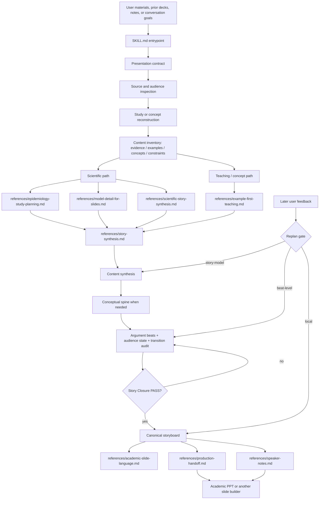

# PPT Planner Architecture

## Structure

- `SKILL.md` is the runtime entrypoint. It establishes the presentation contract, reconstructs the source content, and requires story closure before slide planning.
- `references/story-synthesis.md` is the story-control layer. It defines lightweight presentation state, content synthesis, conceptual-spine selection, argument beats, audience-state reasoning, causal transition auditing, concept admission, story closure, and the replan gate.
- `references/plan-mode.md` defines the user-facing planning format, slide roles, audit checks, and plan-to-build handoff expectations **after** story closure.
- `references/example-first-teaching.md` defines the case-first path for conceptual, tutorial, methods, and group-meeting talks.
- `references/scientific-story-synthesis.md` handles evidence/claim synthesis for multi-analysis or conflict-heavy scientific talks; its outputs feed the general story-synthesis layer rather than directly determining slides.
- `references/production-handoff.md` defines the content contract that slide-building skills must preserve, including exact values, visible copy, case steps, and protected sequences.
- `references/academic-slide-language.md` keeps visible titles and slide copy neutral, descriptive, and free of planner-only meta language.
- `speaker-notes.md` produces presenter notes only after the story and storyboard are stable. It drafts multi-slide beats as continuous speech and applies a speaker-language/granularity audit before handoff.

## Story authority

The planner must not discover the argument by arranging slides. The required order is:

`content synthesis -> story synthesis -> story closure -> slide planning`

A sequence justified only because adjacent topics are related is not enough. Main-path adjacency should normally be supported by a prerequisite relation or by one beat creating the question that the next beat answers. Failure -> mechanism transitions must also be audited so rhetorical smoothness does not imply a false causal relation.

## External boundaries

PPT Planner does not create finished PPTX files. It hands a content-complete, layout-flexible storyboard to a slide-building skill such as Academic PPT. The builder may change layout, split dense slides, and improve visual hierarchy, but must not change the approved scientific meaning, story logic, teaching order, protected examples, or speaker-note narrative.
