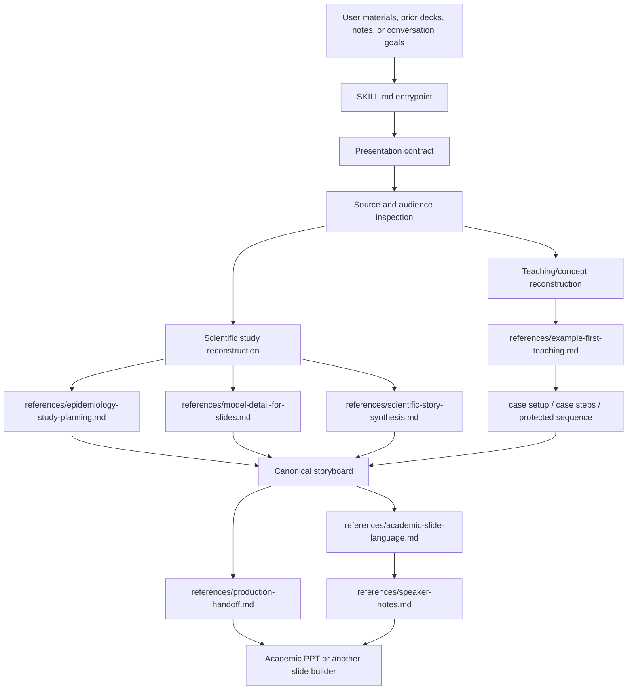

# PPT Planner Architecture

## Structure

- `SKILL.md` is the runtime entrypoint. It sets the presentation contract, selects the scientific or teaching planning path, and routes to the relevant references.
- `references/plan-mode.md` defines the user-facing planning format, slide roles, audit checks, and plan-to-build handoff expectations.
- `references/example-first-teaching.md` defines the case-first teaching path for conceptual, tutorial, methods, and group-meeting talks.
- `references/production-handoff.md` defines the content contract that slide-building skills must preserve, including exact values, visible copy, case steps, and protected sequences.
- `references/academic-slide-language.md` keeps visible titles and slide copy neutral, descriptive, and free of planner-only meta language.
- Scientific references such as `epidemiology-study-planning.md`, `model-detail-for-slides.md`, and `scientific-story-synthesis.md` support conventional research presentations.
- `speaker-notes.md` produces presenter notes only after the storyboard and scope are stable.

## External boundaries

PPT Planner does not create finished PPTX files. It hands a content-complete, layout-flexible storyboard to a slide-building skill such as Academic PPT. The builder may change layout, split dense slides, and improve visual hierarchy, but must not change the approved scientific meaning, teaching order, protected examples, or speaker-note narrative.
